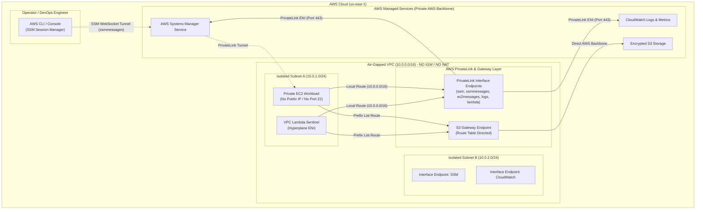

<div align="center">

# 🛡️ AWS Zero-Egress Air-Gapped VPC & PrivateLink Architecture

**Production-ready, highly secure, zero-internet-egress VPC architecture featuring AWS PrivateLink, Keyless EC2 SSM management, VPC Lambda, and an Automated Network Sentinel.**

[](https://www.terraform.io/)
[](https://aws.amazon.com/)
[](https://www.python.org/)
[](https://github.com/ekrmcakir/aws-zero-egress-privatelink/actions)
[](#security-model)
[](LICENSE)

</div>

---

## 📌 Executive Summary

In enterprise, banking, defense, and healthcare environments, hosting compute workloads inside public or standard private subnets exposes organizations to **data exfiltration risks, unmanaged outbound connections, and exorbitant AWS NAT Gateway data processing charges**.

This project implements a **100% Air-Gapped Zero-Egress VPC Architecture** managed via modular **Terraform (IaC)**. 
- **Zero Internet Exposure:** No Internet Gateway (IGW) and No NAT Gateway (`0.0.0.0/0` routes are completely omitted).
- **Private AWS Backbone Routing:** Communication with AWS services (S3, SSM, CloudWatch, Lambda) is strictly tunneled through **AWS PrivateLink (VPC Interface Endpoints)** and **VPC Gateway Endpoints**.
- **Keyless & Bastionless Access:** EC2 instances have **no SSH keys and no port 22 open**; access is secured purely through AWS Systems Manager (SSM) Session Manager over PrivateLink.
- **Continuous Compliance & Leak Sentinel:** A VPC-attached Lambda function and bash verification agent continuously audit egress boundaries to guarantee that no outbound packet can escape to the public internet.

---

## 🏗️ Architecture Diagram



---

## 💰 Cost & Security Comparison

| Architecture Dimension | Standard VPC (NAT Gateway) | Zero-Egress PrivateLink Architecture |
| :--- | :--- | :--- |
| **Internet Gateway (IGW)** | Present | ❌ **Omitted (Zero Attack Surface)** |
| **NAT Gateway Hourly Cost** | ~$32.40 / month per AZ | ❌ **$0.00 (No NAT Gateways)** |
| **NAT Data Processing Cost**| $0.045 / GB | ❌ **$0.00** |
| **S3 Access Cost** | Traverses NAT ($0.045/GB) | ✅ **$0.00 (Free S3 Gateway Endpoint)** |
| **Data Exfiltration Risk** | Medium/High (Egress allowed) | 🛡️ **Zero (Strictly impossible to leak data)** |
| **EC2 Management** | Bastion Host / SSH Keys / Public IPs | 🔐 **AWS SSM Session Manager via PrivateLink** |
| **Compliance Readiness** | Requires complex egress filtering proxies | 🏛️ **Compliant with PCI-DSS, HIPAA, FedRAMP** |

---

## 📂 Repository Structure

```tree
aws-zero-egress-privatelink/
├── .github/
│   └── workflows/
│       └── terraform-ci.yml        # CI Pipeline (terraform validate, fmt, flake8, pytest)
├── terraform/
│   ├── main.tf                     # Root orchestration module
│   ├── variables.tf                # Global input variables
│   ├── outputs.tf                  # Infrastructure outputs & connection commands
│   ├── versions.tf                 # Provider requirements
│   ├── terraform.tfvars.example    # Configuration template
│   └── modules/
│       ├── vpc/                    # Isolated VPC, Subnets, Local-Only Route Tables, NACLs
│       ├── endpoints/              # AWS PrivateLink Interface & S3 Gateway Endpoints
│       ├── iam/                    # Least-privilege IAM Roles & Instance Profiles
│       ├── compute/                # Air-gapped EC2 Instance & IMDSv2 Hardening
│       └── lambda/                 # VPC-attached Network Sentinel Function
├── src/
│   ├── lambda/
│   │   ├── sentinel.py             # Python Network Sentinel probe
│   │   └── requirements.txt        # Runtime dependencies
│   └── tests/
│       └── test_sentinel.py        # Pytest test suite for probe logic
├── scripts/
│   ├── verify-zero-egress.sh       # Comprehensive network egress verification suite
│   ├── deploy.sh                   # Deployment helper script
│   └── destroy.sh                  # Teardown helper script
└── README.md
```

---

## 🚀 Quickstart & Deployment

### Prerequisites
- [AWS CLI v2](https://docs.aws.amazon.com/cli/latest/userguide/install-cliv2.html) configured with active credentials.
- [Terraform >= 1.5.0](https://developer.hashicorp.com/terraform/downloads)
- [Session Manager Plugin](https://docs.aws.amazon.com/systems-manager/latest/userguide/session-manager-working-with-install-plugin.html) for AWS CLI.

### 1. Clone & Configure
```bash
git clone https://github.com/ekrmcakir/aws-zero-egress-privatelink.git
cd aws-zero-egress-privatelink/terraform
cp terraform.tfvars.example terraform.tfvars
```

### 2. Deploy Infrastructure
```bash
terraform init
terraform plan
terraform apply -auto-approve
```

---

## 🧪 Verification & Network Testing

### A. Run Sentinel Lambda Function (Synthetic Leak Test)
Test the VPC Lambda inside the air-gapped subnet to verify that public egress is blocked and PrivateLink connectivity works:

```bash
aws lambda invoke \
  --function-name dev-network-sentinel \
  --region us-east-1 \
  response.json && cat response.json | jq .
```

**Expected JSON Response:**
```json
{
  "compliance": {
    "passed": true,
    "zero_egress_enforced": true,
    "privatelink_functional": true,
    "security_grade": "A+"
  },
  "egress_leak_tests": {
    "direct_ip": {
      "target": "https://1.1.1.1",
      "egress_blocked": true,
      "status": "SECURE_ZERO_EGRESS"
    },
    "domain_name": {
      "target": "https://google.com",
      "egress_blocked": true,
      "status": "SECURE_ZERO_EGRESS"
    }
  },
  "aws_backbone_telemetry": {
    "s3_gateway": {
      "status": "SUCCESS",
      "verified_payload": true
    }
  }
}
```

---

### B. Connect to EC2 via SSM Session Manager (No SSH!)
```bash
# Retrieve EC2 instance ID from Terraform output
INSTANCE_ID=$(terraform output -raw ec2_instance_id)

# Connect via AWS PrivateLink SSM tunnel
aws ssm start-session --target $INSTANCE_ID --region us-east-1
```

Once inside the instance, execute the verification suite:
```bash
# Execute verification script inside air-gapped EC2
bash /opt/internal-workload.sh
```

Or run the network verification suite:
```bash
curl -s --connect-timeout 2 https://google.com
# Output: (28) Connection timed out -> 100% Zero-Egress Protection Verified!

aws s3 ls
# Output: Success -> S3 Gateway Endpoint working seamlessly over AWS backbone!
```

---

## 🔒 Security Best Practices Implemented

1. **IMDSv2 Enforced:** `http_tokens = "required"` configured on EC2 to mitigate SSRF vulnerabilities.
2. **EBS Volume Encryption:** Default KMS/AES256 volume encryption enabled on root blocks.
3. **S3 Public Access Block & Bucket Encryption:** S3 bucket has public access blocked and server-side encryption enabled.
4. **Least-Privilege Security Groups:** Only port 443 outbound to VPC CIDR and S3 Prefix List is allowed.
5. **Private DNS Resolution:** `enable_dns_hostnames` and `enable_dns_support` route standard AWS endpoints (e.g., `ssm.us-east-1.amazonaws.com`) to private IP addresses (10.0.x.x) transparently.

---

## 🧹 Teardown

To destroy all created resources and prevent unwanted charges:

```bash
cd terraform
terraform destroy -auto-approve
```

---

## 📜 License
Distributed under the MIT License. See `LICENSE` for more information.

---

<div align="center">
  Crafted with ❤️ by <a href="https://github.com/ekrmcakir">Ekrem Cakir</a>
</div>
